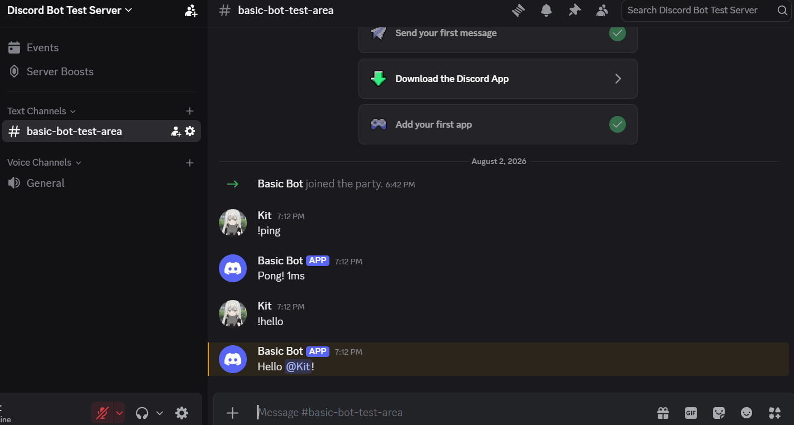
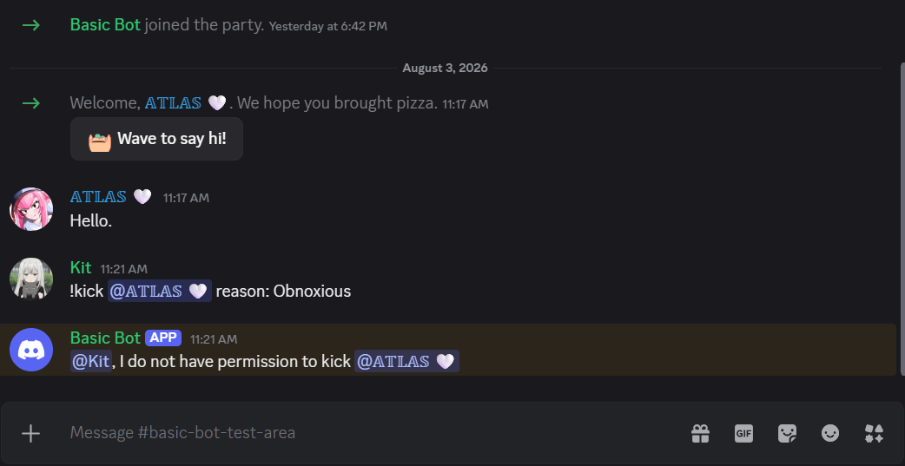
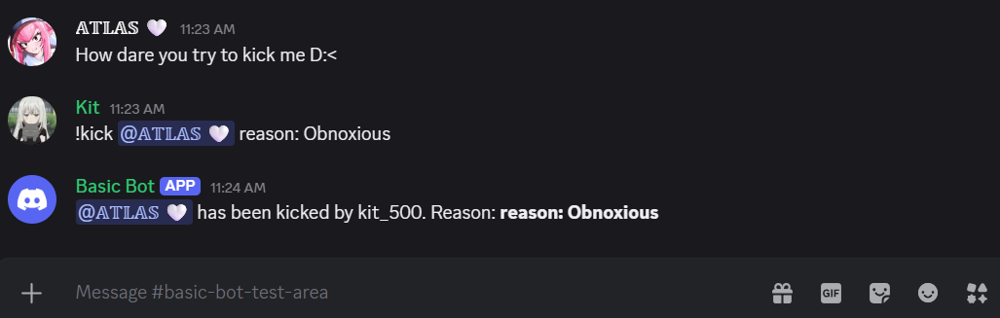

# Discord Bot Template

A clean and customizable **Discord bot template** built with **Python** and **discord.py**.

This project provides a reliable starting point for building custom Discord bots with utility commands, secure configuration handling, and a structure designed for future expansion.

Whether you are creating a community bot, moderation system, automation tool, or interactive server assistant, this template provides the foundation to build upon.

---

## ✨ Features

### ⚡ Utility Commands

| Command  | Description                      |
| -------- | -------------------------------- |
| `!ping`  | Displays the bot's response time |
| `!hello` | Greets a user and mentions them  |

### 🔒 Secure Configuration

* Bot token stored safely using `.env` files
* Sensitive information excluded with `.gitignore`
* No credentials stored directly in the source code

### 🧩 Expandable Design

This template is built with customization in mind and can be extended with additional features.

Future ideas for this template include:


* Kick commands (✅complete)
* Ban commands
* Warning system
* Welcome messages
* Server management tools
* Slash command support
* 8ball command
* Coin flip command
* Interactive community features
* Custom server commands

---

## 📸 Screenshot(s):

Example of the bot running inside Discord:




Some images of the kick command in use were not included.

---

# 🚀 Installation

## 1. Clone the repository

```bash
git clone https://github.com/yourusername/discord-bot-template.git
cd discord-bot-template
```

## 2. Install dependencies

```bash
pip install -r requirements.txt
```

## 3. Configure your environment

Create a file named `.env`:

```env
DISCORD_TOKEN=your_bot_token_here
```

Replace:

```env
your_bot_token_here
```

with your Discord bot token.

---

# ▶️ Running the Bot

Start the bot with:

```bash
python bot.py
```

If everything is configured correctly, the bot will connect and appear online in your Discord server.

---

# 📂 Project Structure

```
discord-bot-template/
│
├── bot.py
├── requirements.txt
├── .env
├── .gitignore
└── commands.png
```

---

# 🛠️ Built With

* Python
* discord.py
* python-dotenv

---

# 🔐 Security

This template follows secure development practices.

The Discord token is stored in a local `.env` file and prevented from being uploaded through `.gitignore`.

Example:

```
.env
```

Never share your Discord bot token publicly.

---

# 📌 About This Template

This project serves as a foundation for creating custom Discord bots for communities, gaming servers, businesses, and online groups.

The template can be expanded with moderation systems, automated workflows, custom commands, integrations, and other Discord features.

---

# 📜 License

This project is licensed under the MIT License.
